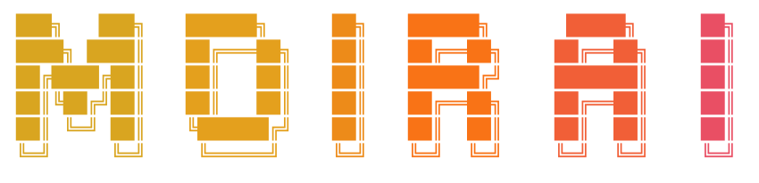

<div align="center">



# Moirai

**Portable continuity for AI agent sessions.**

[](LICENSE)
[](#project-status)
[](#technology)

</div>

Moirai is an open format and reference implementation for recording, moving, and continuing AI agent sessions across tools. It is basically GitHub for your agent sessions: browse their history in a web interface, invite collaborators, and keep sessions private or make them public.

Agent work is often locked inside one harness. Moirai is designed to preserve the useful history of that work, including events, checkpoints, forks, and artifacts, without requiring every agent to share the same runtime or its entire private context.

> [!WARNING]
> Moirai is a new project in its design stage. It does not have a stable format or production-ready implementation yet.

## Continue anywhere

Moirai is designed to make an agent session independent of one harness, one
computer, or one person:

- **Continue across harnesses.** Start a task in Claude Code, continue it in
  Codex, move it to Pi, or hand it to any other compatible agent without
  rebuilding the useful context from scratch.
- **Continue on another computer.** Checkpoint a session on one machine and
  resume it from an authorized laptop, workstation, or server with its history,
  decisions, worktree references, open tasks, and artifacts intact.
- **Let a teammate continue.** Share a scoped checkpoint with another person so
  they can inspect the work, resume it in their preferred harness, or fork a new
  approach with authorship and ancestry preserved.

```text
Claude Code ──┐                    ┌── Laptop
Codex ────────┼── Moirai session ──┼── Server
Pi ───────────┘    checkpoint      └── Teammate's computer
                           │
                           └── continue or fork with clear ancestry
```

Cross-harness continuation does not pretend that every runtime has identical
internal state. A Moirai adapter restores the portable working context—messages
that can be shared, summaries, decisions, tasks, repository state, artifacts,
tool outcomes, and environment metadata—then maps it into the destination
harness. Native checkpoints remain available when an exact same-harness resume
is possible. Hidden chain-of-thought, credentials, and unshared private data do
not travel with the session.

## What Moirai will provide

- Ordered session events
- Immutable checkpoints and named milestones
- Forks with clear ancestry
- References to commits, patches, files, and other artifacts
- Portable imports and exports
- Native checkpoints for exact resume in the original harness
- Portable checkpoints for continuing work in another harness
- Cross-device continuation through authorized remote storage
- Team handoffs with scoped access, attribution, and ancestry
- Selective sharing of sessions and checkpoints
- A web interface for browsing session history, checkpoints, forks, and artifacts
- Private and public sessions with collaborator access

Moirai will not record hidden chain-of-thought. Credentials and raw secrets do not belong in a session archive.

## How it fits

```text
Agent or harness
      |
Moirai adapter
      |
Session repository ---- checkpoints ---- forks
      |                         |
Web interface          collaborators
      |
October Bus or another transport
      |
Another authorized agent or harness
```

Moirai owns the portable session record. A harness decides what to capture and how to resume its own native state. October Bus can carry scoped references and access to those records, but Moirai does not require October Bus or October.

## Core concepts

| Concept | Meaning |
| --- | --- |
| Session | One connected history of agent work |
| Event | An ordered, immutable record of something that happened |
| Checkpoint | A stable point that can be inspected, shared, or resumed |
| Artifact | A referenced output such as a commit, patch, file, or report |
| Fork | A new line of work with recorded ancestry |
| Native checkpoint | Harness-specific state for the most faithful resume |
| Portable checkpoint | Standardized state another compatible harness can understand |

## Safety and privacy

Session history can contain sensitive work. Moirai is being designed around a few strict rules:

- Capture is explicit and inspectable.
- Local storage is the default.
- Remote storage and sharing are opt-in.
- Access is scoped to the session or checkpoint being shared.
- Secret redaction happens before persistence or export.
- Retention and deletion remain under the user's control.
- Imported archives are treated as untrusted input.

The format will preserve useful context, not private model reasoning.

## Technology

The protocol and archive format will be language-independent.

- **Go** will power the reference library, CLI, and local store. It gives Moirai a small cross-platform binary and fits durable local infrastructure well.
- **TypeScript** will be the first client SDK for desktop tools and popular agent harnesses.
- Other SDKs, including Python, can implement the same public format as adoption grows.

The Go implementation is the reference implementation, not the standard itself. Compatible implementations will be free to use any language.

## Project status

The repository currently establishes the project, its safety boundary, and its implementation direction. The public format and APIs are not stable yet.

The npm name [`@october-dev/moirai`](https://www.npmjs.com/package/@october-dev/moirai) is reserved for the official TypeScript SDK. Its initial prerelease contains no supported API.

If you want to help shape portable agent sessions, open an issue or read [CONTRIBUTING.md](CONTRIBUTING.md).

## Contributing

Contributions are welcome, especially around portable formats, secure local storage, importers, SDKs, and harness integrations. Please read [CONTRIBUTING.md](CONTRIBUTING.md) before opening a pull request.

Report security issues privately through [SECURITY.md](SECURITY.md).

## License

Moirai is licensed under the [Apache License 2.0](LICENSE). The permissive license is intentional so open and commercial agent tools can adopt the format.

## Trademark

The Apache 2.0 license applies to the code and documentation in this repository. It does not grant rights to October's names, logos, or other brand assets. Do not imply endorsement by October.

---

<div align="center">

Built in the open by [October](https://october.dev) · [GitHub](https://github.com/october-dev)

</div>
